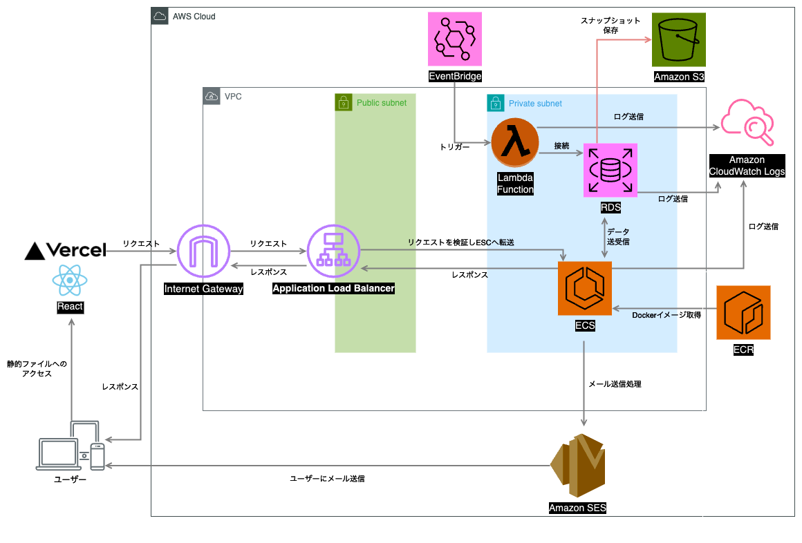
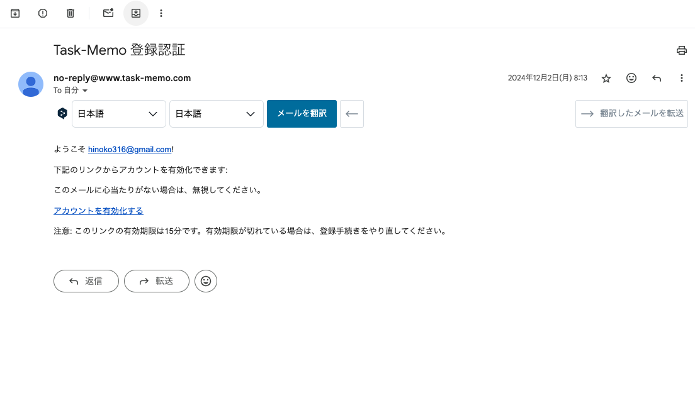
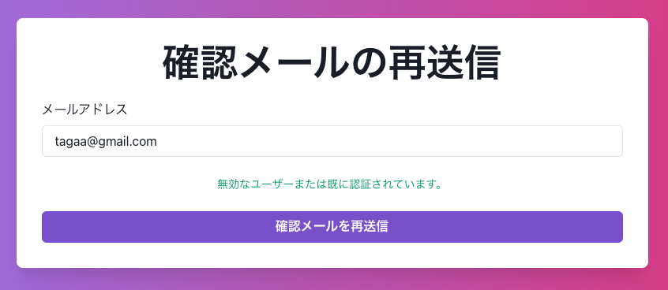
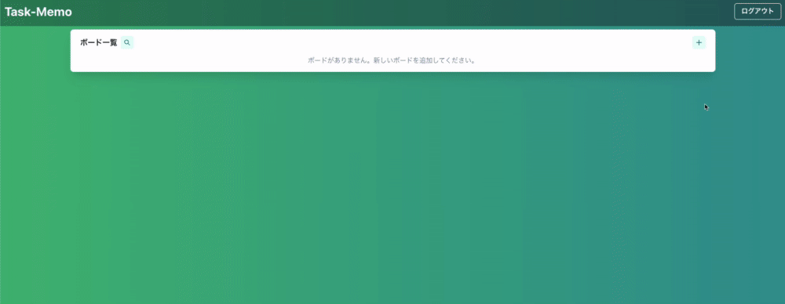

# Task-Memo

スキル向上を目的にポートフォリオとしてタスク管理アプリを作成しました。  
シングルページアプリケーション (SPA) として主に下記の構成で作成しています。

- フロントエンドは TypeScript / React
- バックエンドは Ruby on Rails
- インフラは Vercel (静的サイト) / AWS(API)
- モノレポ構成
- バックエンドとフロントエンドの開発環境は両方ともDockerを使用

詳細は後述の「開発環境 (フロントエンド)」「開発環境 (バックエンド)」「本番環境」をご覧ください。

## 目次

- [機能](#機能)
- [フロントエンド](#フロントエンド)
- [バックエンド](#バックエンド)
- [インフラ](#インフラ)
  - [インフラ構成図](#インフラ構成図)
- [ER図](#ER図)
- [画面](#画面)

## 機能

### 認証
- ユーザー登録
- メールアドレス認証
  - 認証メール再送信
  - 未認証ユーザー削除 (定期処理)
- ログイン / ログアウト
  - Cookie / セッション
- ゲストユーザーログイン
- パスワードリセット
  - リセットメール認証

### タスク管理
- 作成 / 表示 / 更新 / 削除
- ボード（タスクグループ） 作成 / 表示 / 更新 / 削除
- タスク（各ボードに紐づく） 作成 / 表示 / 更新 / 削除
- 検索
- 絞り込み
- 並び替え    
  - ドラッグ&ドロップ  
  - 状態保持

## フロントエンド

本プロジェクトのフロントエンドは、TypeScriptとReactを使用し、モダンな設計と高速なユーザー体験を実現しています。  
Viteをビルドツールに採用し、開発効率を向上させました。  
また、UIはChakra UIを活用し、ユーザーフレンドリーで統一感のあるデザインを実現しました。

### 主な使用技術
- TypeScript (5.5.3): 型安全性と保守性の向上。
- React (18): 再利用可能なコンポーネント設計。
- Chakra UI (2.10.1): デザインの一貫性と迅速なUI構築。
- SWR (2.2.5): キャッシュ管理とリアルタイムデータ取得。
- React Hook Form (7.53.1) + Yup (1.4.0): フォームバリデーションの効率化。
- Jest: 

### 技術選定理由
- TypeScript: 型安全性により、バグの早期発見が可能。コード保守性を向上し、チーム開発時に役立つ。
- React: 再利用性の高いコンポーネント設計で、スケーラブルなフロントエンド開発を実現。
- Chakra UI: 一貫したデザインと開発効率を両立。ユーザーフレンドリーなUIを短期間で構築可能。
- SWR: 軽量でシンプルなデータ取得ライブラリにより、リアルタイム通信のレスポンス速度を向上。
- React Hook Form + Yup: フォームのバリデーションとエラーハンドリングを簡潔に実装。
- Jest: 

### 開発環境
- Vite: 5.4.8: ビルドの高速化とホットリロードを実現。
- Docker: ローカル開発環境と本番環境を一致させ、動作の一貫性を確保。
- ESLint / Prettier / Stylelint: コードスタイルを統一。コードレビューを効率化し、品質を確保。

### ディレクトリ構成
保守性と拡張性を重視し、アトミックデザインの概念に基づいて設計。  
コンポーネントの再利用性とメンテナンス性を向上させています。
```plaintext
src/
├── App.tsx          # アプリのメインコンポーネント
├── components/      # UIコンポーネント（アトミックデザイン）
├── features/        # 特定の機能に関連するコード（例: 認証）
├── routes/          # ルーティング設定
├── urls/            # APIやリンクのURL管理
└── utils/           # 汎用的な関数やAPIリクエスト関連
```
### 採用技術による効果
- UI/UXを意識した設計により、直感的な操作性を実現。
- リアルタイム通信やキャッシュ管理を最適化し、ユーザー体験を向上。
- 高速なビルドやコンポーネントの再利用による開発者体験を向上。

---

## バックエンド

バックエンドは、Ruby on Railsを用いて構築し、トークンベースの認証やAPI設計を実現しています。  
データベースにはMySQLを使用し、高速で信頼性の高いデータ処理を提供します。

### 主な使用技術
- Ruby (3.3.4): シンプルで直感的な文法を持つプログラミング言語。
- Rails (7.1.4): 高い開発効率と豊富なエコシステム。
- MySQL (8.0.40): 高速な読み込みと安定性。
- Puma (6.4.2): マルチスレッド対応のアプリケーションサーバー。
- Devise + Devise Token Auth: 安全なトークンベースの認証。

### 技術選定理由
- Rails: MVCアーキテクチャにより迅速な開発が可能。豊富なライブラリ（Gem）を活用し、認証やバリデーションなどの機能を効率的に実装。
- MySQL: データ整合性と高速な読み書き性能を重視し採用。
- Devise Token Auth: SPAやモバイルアプリに対応したトークンベース認証を簡単に実装。

### 開発環境
- Docker: ローカル開発環境と本番環境を一致させ、動作の一貫性を確保。
- AWS Secrets Manager: 機密情報をセキュアに管理し、運用負担を軽減。
- Rack CORS: フロントエンドと安全に連携するためのCORS設定を実装。

### データベース構造
データベースは、users, boards, tasksの3つの主要テーブルで構成されています。
- users: 認証情報を管理。
- boards: タスクを分類するグループ。
- tasks: 各タスクの詳細情報を管理。
以下はデータベースのER図です。


### 採用技術による効果
- Railsにより、短期間での開発と認証・API実装を効率化。
- MySQLにより、大量データの高速処理とデータ整合性を確保。

---

## インフラ

本プロジェクトのインフラは、AWSを中心に構築され、スケーラビリティと運用効率を重視しています。  
ECSを利用してコンテナのオーケストレーションを行い、APIサーバーの管理を効率化しました。

### 主な使用技術
- ECS (Elastic Container Service): コンテナのスケーリングと管理。
- RDS (Aurora MySQL): 高性能かつ信頼性のあるリレーショナルデータベース。
- S3 (Simple Storage Service): 静的ファイルの保存とバックアップ管理。
- CloudWatch: ログとメトリクスの監視。
- Step Functions: ワークフロー管理の自動化。

### 技術選定理由
- ECS: コンテナ化されたAPIサーバーを効率的にデプロイ・スケーリング可能。  
- RDS: データ整合性と高い読み取り性能を持つリレーショナルデータベース。  
- S3: 高耐久性のストレージサービスで、バックアップと静的リソース管理を効率化。  
- CloudWatch: リアルタイムの監視とログ管理を実現し、障害検知を迅速化。  
- Step Functions: サーバーのスケジュール起動や停止など、運用コストを削減するために採用。

### インフラ構成図


### 採用技術による効果
- 自動スケーリングやモニタリング機能により、可用性とパフォーマンスを最適化。  
- S3を活用したバックアップ管理でデータ損失リスクを最小化。

## 画面

### ホーム


### ログイン
- 入力時バリデーション

- 送信時バリデーション


### ユーザー登録
- 入力時バリデーション

- 送信時バリデーション


### メールアドレス認証
- 認証確認通知

- 認証用メール


 ### 認証メール再送信
 - 送信時バリデーション


### パスワードリセット
- 再設定リクエスト入力時バリデーション

- リクエスト送信時バリデーション

- 再設定用メール

- 再設定画面入力時バリデーション


### ゲストログイン


### ボードCRUD


### タスクCRUD


### 検索


### 絞り込み


### 並び替え


