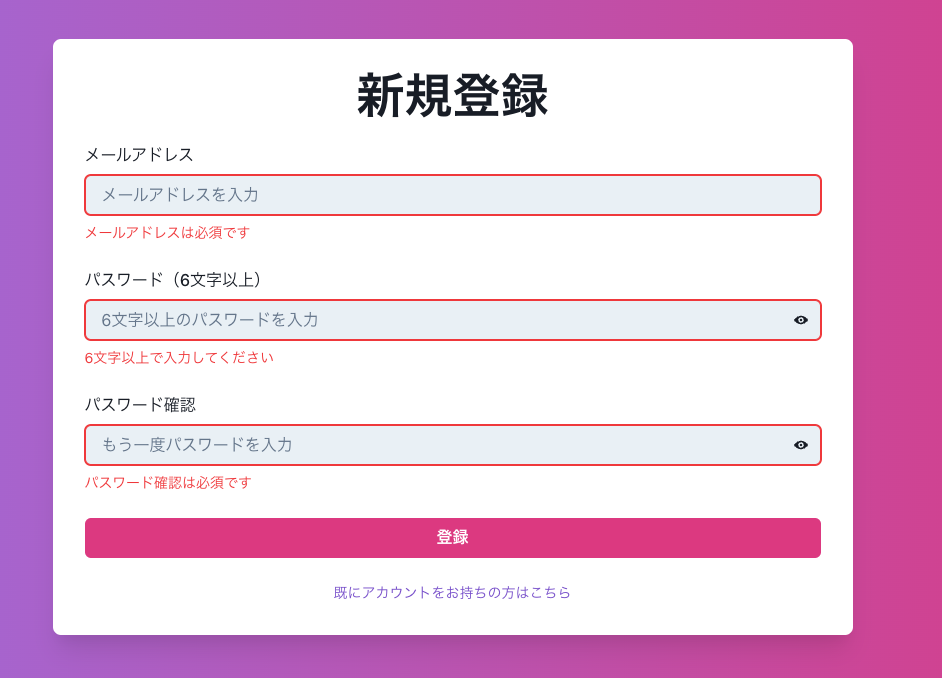
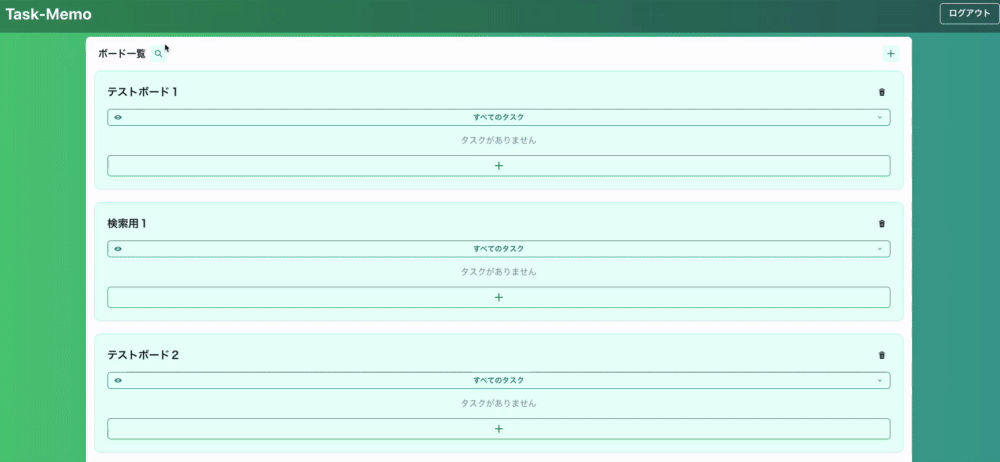
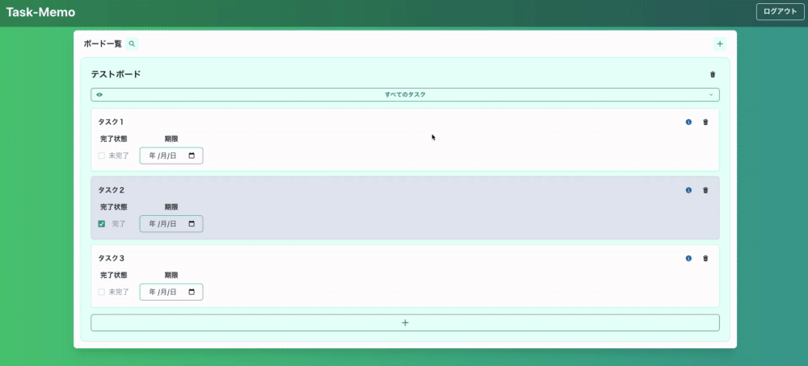

# Task-Memo
[Task-Memo](https://www.task-memo.com/)は日常のタスク管理を効率化し、直感的な操作性を実現するために開発したアプリケーションです。  
**認証機能やドラッグ＆ドロップによるタスク並び替え**など、効率的なタスク管理をサポートする機能を搭載しています。

このアプリは、**未経験からの転職を目指し実践的なスキルを身につける**ため、  
モダンな技術スタックを活用して一つのアプリを作り切ることを目標に開発しました。

---

## **主な機能**
- **ユーザー認証**
  - メールアドレス認証 / パスワードリセット / ゲストログイン
- **タスク管理**
  - タスクとボード（タスクグループ）のCRUD機能
  - 検索、絞り込み、並び替え（ドラッグ＆ドロップ対応）

---

## **動作イメージ**

### タスクCRUD
タスクの作成、表示、編集、削除を簡単に操作できます。  


### 並び替え (ドラッグ＆ドロップ)
直感的な操作でタスクの優先順位を調整できます。


### ゲストログイン
登録不要で簡単にアプリの機能を試せるため、初めてのユーザーでも操作を気軽に体験できます。


---

## **技術スタック**

### 開発環境
- **Docker**: ローカルと本番の環境差異を排除した統一的な構築。
- **モノレポ構成**: フロントエンドとバックエンドを1つのリポジトリで管理。

### フロントエンド
[採用技術や選定理由の詳細](./docs/frontend.md)
- **TypeScript**: 型安全性を確保し、保守性を向上。
- **React**: 再利用可能なコンポーネント設計。
- **Chakra UI**: 統一感のあるデザインを簡潔に構築。
- **Vite**: 高速なビルドとホットリロードを実現。

### バックエンド
[ER図やAPI設計の詳細](./docs/backend.md)
- **Ruby on Rails**: 高い生産性と信頼性を持つWebフレームワーク。
- **MySQL**: 大量データの高速処理と安定した運用を実現。

### インフラ
[AWS構成の詳細](./docs/infrastructure.md)
- **AWS ECS**: コンテナ単位で柔軟にスケールアップ可能。
- **RDS (Aurora MySQL)**: 高い耐障害性とデータ整合性。
- **S3**: 静的ファイルの保存とバックアップ管理。
- **CloudWatch**: リアルタイム監視とログ管理を実現。
- **Vercel**: 静的サイトのホスティング。

#### インフラ構成図
この構成により、フロントエンドとバックエンドを分離しつつ、アクセス増加時に柔軟にスケールアップ対応が可能です。


---

## **設計のポイント**
- **直感的な操作性**:  
  ドラッグ＆ドロップ機能を導入し、タスクの並び替えを効率化。  
  **検索・絞り込み**により必要な情報をすばやく取得可能。
- **高速な開発環境**:  
  Viteを採用し、ビルド時間を短縮。ホットリロードにより開発体験を向上。
- **開発効率とチーム開発への配慮**:  
  Dockerとモノレポ構成で環境差異を排除し、スムーズなデプロイと統一的なコード管理を実現。
- **スケーラビリティ**:  
  AWS ECSを使用したアーキテクチャで、負荷に応じた柔軟なスケールアップが可能。

---

## **苦労した点**
開発中に直面した課題やトラブル解決のプロセスを、Qiitaにまとめています。  
- [モノレポ構成とCORSの解決策](https://qiita.com/kumazaki-y/items/7acbbfdbac9a838477a1))
- [AWS構築で直面した課題と解決](https://qiita.com/kumazaki-y/items/dc8c9270a6b73df1a765)
- [Vite×Dockerでのビルドエラー対応](https://qiita.com/kumazaki-y/items/9faf6ab4712d4c6e5c72)

---

## 目次

- [機能](#機能)
- [フロントエンド](#フロントエンド)
- [バックエンド](#バックエンド)
- [インフラ](#インフラ)
  - [インフラ構成図](#インフラ構成図)
- [ER図](#ER図)
- [画面](#画面)

## 機能

### 認証
- ユーザー登録
- メールアドレス認証
  - 認証メール再送信
  - 未認証ユーザー削除 (定期処理)
- ログイン / ログアウト
  - Cookie / セッション
- ゲストユーザーログイン
- パスワードリセット
  - リセットメール認証

### タスク管理
- 作成 / 表示 / 更新 / 削除
- ボード（タスクグループ） 作成 / 表示 / 更新 / 削除
- タスク（各ボードに紐づく） 作成 / 表示 / 更新 / 削除
- 検索
- 絞り込み
- 並び替え    
  - ドラッグ&ドロップ  
  - 状態保持

## フロントエンド

本プロジェクトのフロントエンドは、TypeScriptとReactを使用し、モダンな設計と高速なユーザー体験を実現しています。  
Viteをビルドツールに採用し、開発効率を向上させました。  
また、UIはChakra UIを活用し、ユーザーフレンドリーで統一感のあるデザインを実現しました。

### 主な使用技術
- TypeScript (5.5.3): 型安全性と保守性の向上。
- React (18): 再利用可能なコンポーネント設計。
- Chakra UI (2.10.1): デザインの一貫性と迅速なUI構築。
- SWR (2.2.5): キャッシュ管理とリアルタイムデータ取得。
- React Hook Form (7.53.1) + Yup (1.4.0): フォームバリデーションの効率化。
- Jest: 

### 技術選定理由
- TypeScript: 型安全性により、バグの早期発見が可能。コード保守性を向上し、チーム開発時に役立つ。
- React: 再利用性の高いコンポーネント設計で、スケーラブルなフロントエンド開発を実現。
- Chakra UI: 一貫したデザインと開発効率を両立。ユーザーフレンドリーなUIを短期間で構築可能。
- SWR: 軽量でシンプルなデータ取得ライブラリにより、リアルタイム通信のレスポンス速度を向上。
- React Hook Form + Yup: フォームのバリデーションとエラーハンドリングを簡潔に実装。
- Jest: 

### 開発環境
- Vite: 5.4.8: ビルドの高速化とホットリロードを実現。
- Docker: ローカル開発環境と本番環境を一致させ、動作の一貫性を確保。
- ESLint / Prettier / Stylelint: コードスタイルを統一。コードレビューを効率化し、品質を確保。

### ディレクトリ構成
保守性と拡張性を重視し、アトミックデザインの概念に基づいて設計。  
コンポーネントの再利用性とメンテナンス性を向上させています。
```plaintext
src/
├── App.tsx          # アプリのメインコンポーネント
├── components/      # UIコンポーネント（アトミックデザイン）
├── features/        # 特定の機能に関連するコード（例: 認証）
├── routes/          # ルーティング設定
├── urls/            # APIやリンクのURL管理
└── utils/           # 汎用的な関数やAPIリクエスト関連
```
### 採用技術による効果
- UI/UXを意識した設計により、直感的な操作性を実現。
- リアルタイム通信やキャッシュ管理を最適化し、ユーザー体験を向上。
- 高速なビルドやコンポーネントの再利用による開発者体験を向上。

---

## バックエンド

バックエンドは、Ruby on Railsを用いて構築し、トークンベースの認証やAPI設計を実現しています。  
データベースにはMySQLを使用し、高速で信頼性の高いデータ処理を提供します。

### 主な使用技術
- Ruby (3.3.4): シンプルで直感的な文法を持つプログラミング言語。
- Rails (7.1.4): 高い開発効率と豊富なエコシステム。
- MySQL (8.0.40): 高速な読み込みと安定性。
- Puma (6.4.2): マルチスレッド対応のアプリケーションサーバー。
- Devise + Devise Token Auth: 安全なトークンベースの認証。

### 技術選定理由
- Rails: MVCアーキテクチャにより迅速な開発が可能。豊富なライブラリ（Gem）を活用し、認証やバリデーションなどの機能を効率的に実装。
- MySQL: データ整合性と高速な読み書き性能を重視し採用。
- Devise Token Auth: SPAやモバイルアプリに対応したトークンベース認証を簡単に実装。

### 開発環境
- Docker: ローカル開発環境と本番環境を一致させ、動作の一貫性を確保。
- AWS Secrets Manager: 機密情報をセキュアに管理し、運用負担を軽減。
- Rack CORS: フロントエンドと安全に連携するためのCORS設定を実装。

### データベース構造
データベースは、users, boards, tasksの3つの主要テーブルで構成されています。
- users: 認証情報を管理。
- boards: タスクを分類するグループ。
- tasks: 各タスクの詳細情報を管理。
以下はデータベースのER図です。


### 採用技術による効果
- Railsにより、短期間での開発と認証・API実装を効率化。
- MySQLにより、大量データの高速処理とデータ整合性を確保。

---

## インフラ

本プロジェクトのインフラは、AWSを中心に構築され、スケーラビリティと運用効率を重視しています。  
ECSを利用してコンテナのオーケストレーションを行い、APIサーバーの管理を効率化しました。

### 主な使用技術
- ECS (Elastic Container Service): コンテナのスケーリングと管理。
- RDS (Aurora MySQL): 高性能かつ信頼性のあるリレーショナルデータベース。
- S3 (Simple Storage Service): 静的ファイルの保存とバックアップ管理。
- CloudWatch: ログとメトリクスの監視。
- Step Functions: ワークフロー管理の自動化。

### 技術選定理由
- ECS: コンテナ化されたAPIサーバーを効率的にデプロイ・スケーリング可能。  
- RDS: データ整合性と高い読み取り性能を持つリレーショナルデータベース。  
- S3: 高耐久性のストレージサービスで、バックアップと静的リソース管理を効率化。  
- CloudWatch: リアルタイムの監視とログ管理を実現し、障害検知を迅速化。  
- Step Functions: サーバーのスケジュール起動や停止など、運用コストを削減するために採用。

### インフラ構成図


### 採用技術による効果
- 自動スケーリングやモニタリング機能により、可用性とパフォーマンスを最適化。  
- S3を活用したバックアップ管理でデータ損失リスクを最小化。

## 画面

### ホーム


### ログイン
- 入力時バリデーション

- 送信時バリデーション


### ユーザー登録
- 入力時バリデーション

- 送信時バリデーション


### メールアドレス認証
- 認証確認通知

- 認証用メール


 ### 認証メール再送信
 - 送信時バリデーション


### パスワードリセット
- 再設定リクエスト入力時バリデーション

- リクエスト送信時バリデーション

- 再設定用メール

- 再設定画面入力時バリデーション


### ゲストログイン


### ボードCRUD


### タスクCRUD


### 検索


### 絞り込み


### 並び替え


